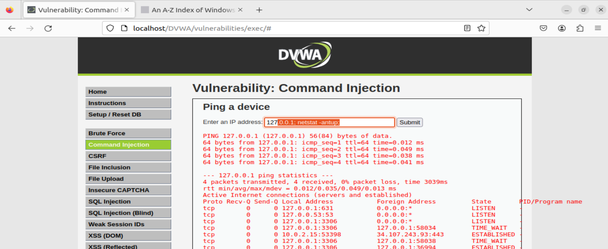
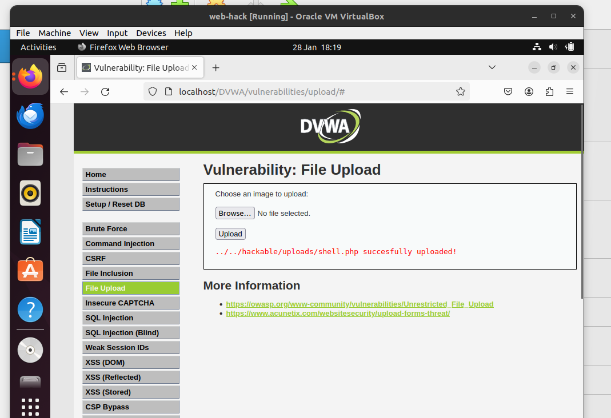
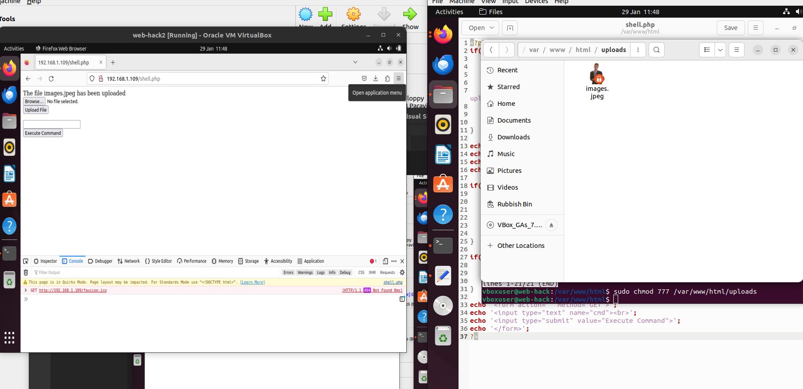
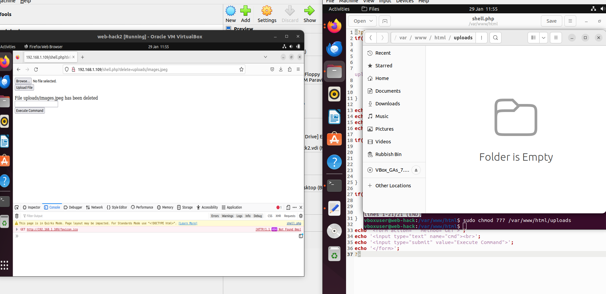
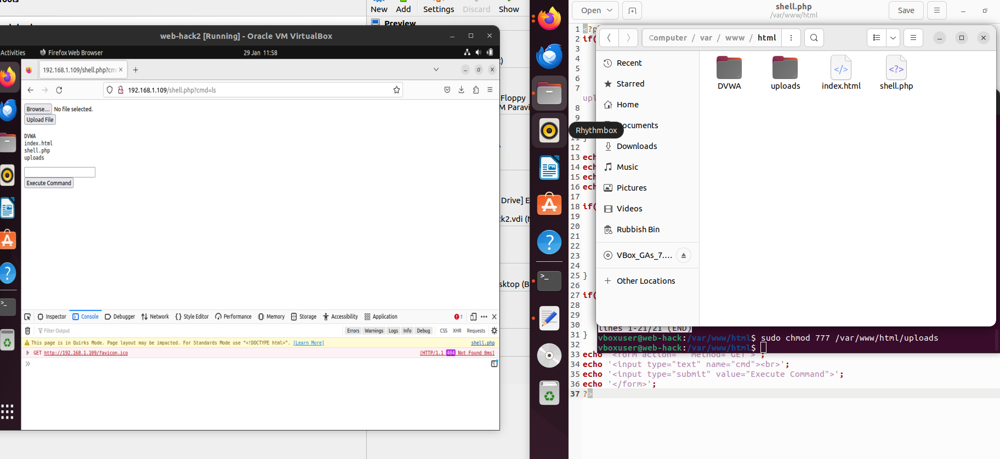

# WEB HACK

This project was run on DVWA on an VM. Th eobject was to find 3 vulnerabilites to add, delete files and execute commands. Audit questions down below.

## Command injection

Command injections are possible when an application passes unsafe user supplied data to a system shell. The attackers commands are then executed with the privileges of the vulnerable application. Command injection attacks are possible due to insufficient input validation.

1. In this example we demonstrate how lack of input data validation allows hackers to execute commands.This can lead to all sorts of dangers like unauthorized access, data leakage or system compromise

   

2. Now to demonstrate how to run these remotely I start a second VM and upload a php-shell on the first one. THis allows us to upload files on the first machine.

   

3. Now we can add rick img to the first vm as was our mission.

   

4. And we can also delete files

   

5. As well as execute commands

   

##

## Prevention

To prevent these insidents:

1. inputs should be validated rejecting any special characters like ; & etc
2. Limiting user permissions, not allowing execute system-level commands
3. Using web-application firewalls
4. Using prepared SQL statements with parameterized queries.

### Does the student have the ability to exploit 3 vulnerabilities?

### Can the student's webshell at least add a file, and delete it in its current directory?

### Can the student webshell execute commands on the terminal?

### Is the webshell developed in PHP?
